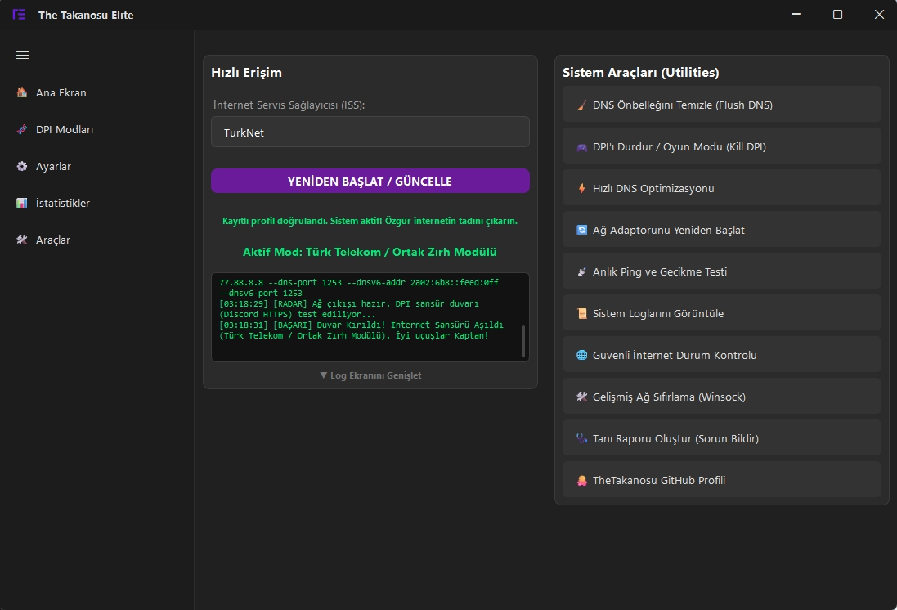
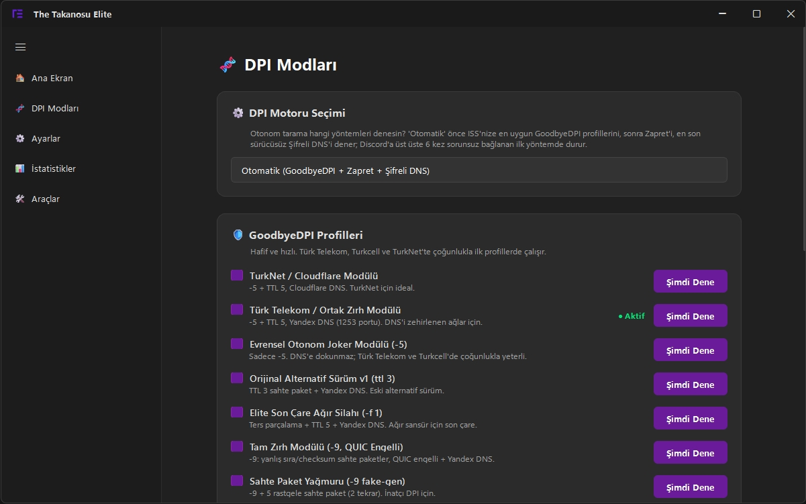
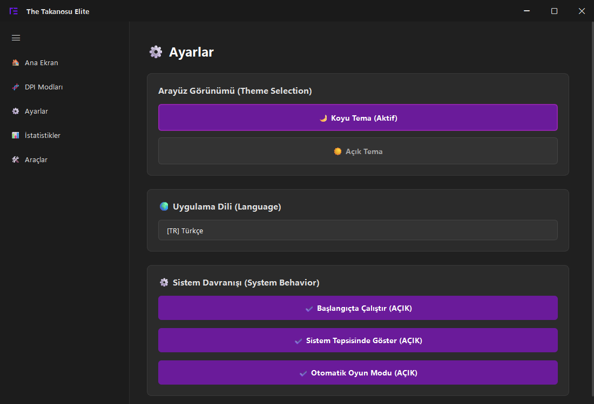

# The Takanosu Elite

**Türkiye'deki internet engellerini tek tıkla aşan, oyun dostu GoodbyeDPI + Zapret arayüzü**

[**⬇️ İndir**](https://github.com/TheTakanosu/GoodbyeDPI-Turkey-Fixed-Edition/releases/latest) · [Sık sorulanlar](docs/sss.md) · [Sorun giderme](docs/sorun-giderme.md) · [Tartışmalar](https://github.com/TheTakanosu/GoodbyeDPI-Turkey-Fixed-Edition/discussions)

## Ne işe yarar?

Discord gibi erişimi engellenmiş sitelere VPN kullanmadan erişmenizi sağlar. Arka planda [GoodbyeDPI](https://github.com/ValdikSS/GoodbyeDPI) ve [Zapret](https://github.com/bol-van/zapret) motorlarını çalıştırır. Hangi ayarın sizin internetinizde çalıştığını kendisi bulur. Siz sadece başlat düğmesine basarsınız.

- **Otomatik tarama:** ISS'nizi (Türk Telekom, Superonline, TurkNet, Vodafone, Kablonet) tespit eder, 13 profili size uygun sırayla dener. Discord'a **6 kez üst üste** sorunsuz bağlanan ilk profilde durur.
- **Oyun Modu:** Anti-cheat'li bir oyun (Apex, Fortnite, R6, Rocket League, CS2 + FACEIT…) açılınca motoru ve sürücüyü tamamen kapatır. Oyun sırasında Discord'u şifreli DNS ile ayakta tutar. Oyun kapanınca her şey eski haline döner.
- **Bilgisayar açılınca kendiliğinden başlar.** UAC penceresi çıkmaz, son çalışan profil birkaç saniyede geri gelir.
- **Nöbetçi:** İnternetiniz değişirse (modem yeniden başladı, ISS ayar değiştirdi) fark eder ve yeniden tarar.
- **Ping'e dokunmaz:** Oyun trafiğine müdahale etmez. Ölçümlerde motor açıkken ve kapalıyken gecikme farkı görülmedi.
- **Açık kaynak:** Kodun tamamı [`src/`](src) klasöründe.

## Kurulum

1. [**Son sürümü indirin**](https://github.com/TheTakanosu/GoodbyeDPI-Turkey-Fixed-Edition/releases/latest). Sayfanın altındaki **Assets** bölümünde `_Setup.exe` ile biten dosya.
2. Çalıştırın. Eski GoodbyeDPI kurulumlarından kalan servisler kurulum sırasında otomatik temizlenir.
3. Masaüstündeki **The Takanosu Elite** kısayolunu açın ve **OTONOM SİSTEMİ BAŞLAT**'a basın.

Bu kadar. Uygulama tepsiye iner ve arka planda çalışmaya devam eder.

> [!NOTE]
> **Güncellemeler kendiliğinden gelir.** Yeni sürüm çıktığında uygulama açılışta haber verir ve tek tıkla günceller. Her sürümde nelerin değiştiği [Releases](https://github.com/TheTakanosu/GoodbyeDPI-Turkey-Fixed-Edition/releases) sayfasında yazıyor.

> [!WARNING]
> **Antivirüs uyarısı alabilirsiniz.** Uygulama, engeli aşmak için WinDivert ağ sürücüsünü kullanıyor. Bu yüzden bazı antivirüsler yanlış alarm verebiliyor. **Kaspersky** sürücüyü engellediği için uygulama Kaspersky açıkken çalışmayabilir. Ayrıntılar: [Virüs mü?](docs/sss.md#antivirüsüm-uyarı-veriyor-virüs-mü)

## Ekran görüntüleri

| DPI Modları | Ayarlar |
|---|---|
|  |  |
| 13 profilin hepsini görün, istediğinizi tek tıkla deneyin | Başlangıçta çalıştırma, Oyun Modu, tema |

## Bir sorun mu var?

1. Uygulamada **🩺 Tanı Raporu Oluştur** düğmesine basın. Rapor panoya kopyalanır.
2. [Tartışmalar](https://github.com/TheTakanosu/GoodbyeDPI-Turkey-Fixed-Edition/discussions) sayfasında ya da [yeni bir hata bildiriminde](https://github.com/TheTakanosu/GoodbyeDPI-Turkey-Fixed-Edition/issues/new/choose) paylaşın.

Özellikle **Vodafone ve Kablonet** kullanıcılarının raporları çok değerli, bu altyapılar için henüz yeterli veri yok.

## Belgeler

| | |
|---|---|
| [Profiller](docs/profiller.md) | 13 profil ne yapar, hangisi kime uygun, gerçek ölçüm sonuçları |
| [Sık sorulanlar](docs/sss.md) | Virüs uyarısı, ban riski, DNS, başlangıç |
| [Sorun giderme](docs/sorun-giderme.md) | Tanı raporu, Discord açılmıyor, DNS bozuldu |
| [Sürüm notları](https://github.com/TheTakanosu/GoodbyeDPI-Turkey-Fixed-Edition/releases) | Her sürümde neler değişti |
| [Geliştirme](docs/gelistirme.md) | Kaynaktan derleme |
| [Lisanslar](docs/lisanslar.md) | Kullanılan üçüncü parti bileşenler |

## Teşekkürler

- **[ValdikSS](https://github.com/ValdikSS/GoodbyeDPI):** GoodbyeDPI
- **[bol-van](https://github.com/bol-van/zapret):** Zapret
- **Çağrı Taşkın:** ilk Türkiye yapılandırmaları
- **TheTakanosu:** otonom motor, arayüz ve Elite sürümü

Bu proje [GPL-3.0](LICENSE) lisanslıdır.
